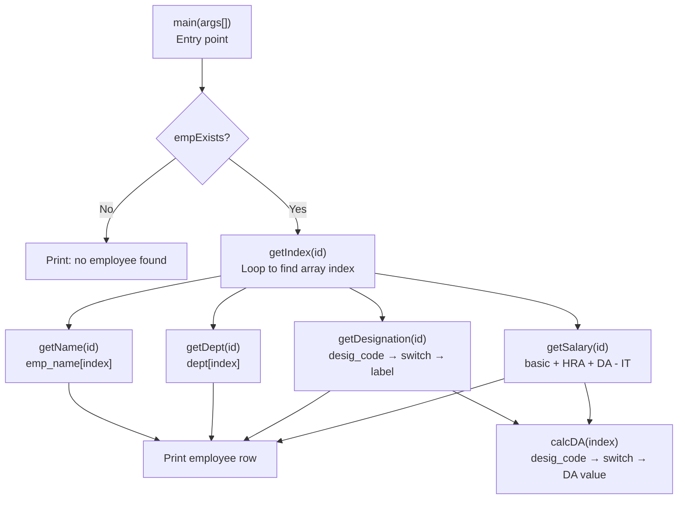

# Employee Information System

A Java console application that retrieves and displays employee details based on Employee ID.

Built as part of the **Wipro Pre-Joining Program (PJP)** — completed prior to onboarding as a selected Wipro recruit.

---

## Features

- Look up employee by ID
- Displays: Employee Number, Name, Department, Designation, and Net Salary
- Salary calculated as: `Basic + HRA + DA - Income Tax`
- DA (Dearness Allowance) determined by designation level
- Handles invalid employee ID with a clear error message

## How it works



## Designation & DA Structure

| Code | Designation   | DA (₹)  |
|------|---------------|---------|
| e    | Engineer      | 20,000  |
| c    | Consultant    | 32,000  |
| k    | Clerk         | 12,000  |
| r    | Receptionist  | 15,000  |
| m    | Manager       | 40,000  |

## How to Run

### Prerequisites
- Java JDK installed ([Download here](https://www.oracle.com/java/technologies/downloads/))

### Steps

```bash
# 1. Clone the repository
git clone https://github.com/YOUR_USERNAME/employee-information-system.git
cd employee-information-system

# 2. Compile
javac employeeInformation.java

# 3. Run with an Employee ID (1001 to 1007)
java employeeInformation 1001
```

### Sample Output

```
Emp No.    Emp Name    Department    Designation    Salary
   1001      Ashish           R&D       Engineer     45000
```

### Invalid ID

```
There is no employee with empid: 1008
```

## Salary Calculation Example

For Employee 1001 (Ashish, Engineer):
- Basic: ₹20,000
- HRA: ₹8,000
- DA: ₹20,000 (Engineer)
- Income Tax: -₹3,000
- **Net Salary: ₹45,000**

## What I Learned

- Java class design and encapsulation (private data, public methods)
- Array-based data storage and linear search
- Command-line argument handling in Java
- Switch-case for designation-based logic
- Formatted console output using `printf`

## Future Improvements

- [ ] Use `ArrayList` and objects instead of parallel arrays
- [ ] Add ability to list all employees
- [ ] Read employee data from a file or database
- [ ] Add joining date and experience calculation

---

*Developed during Wipro Pre-Joining Program (PJP) — 2022*
