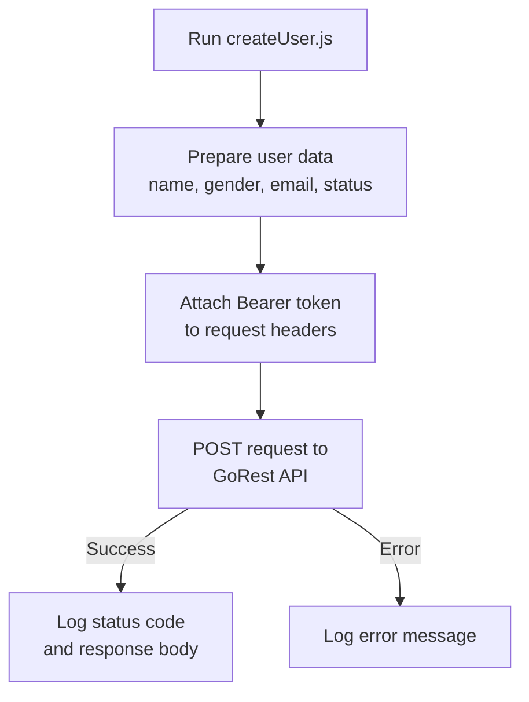

# GoRest API - Create User

A Node.js script that creates a new user by making a POST request to the [GoRest REST API](https://gorest.co.in), using Bearer token authentication.

Built as part of learning JavaScript, REST APIs, and authentication in Node.js.

---

## What it does

- Sends a POST request to the GoRest API with user details
- Authenticates using a Bearer token
- Logs the response status and created user data
- Handles errors gracefully

## How it works



## How to Run

### Prerequisites
- Node.js installed ([Download here](https://nodejs.org/))
- A free GoRest API token ([Get one here](https://gorest.co.in))

### Steps

```bash
# 1. Clone the repository
git clone https://github.com/YOUR_USERNAME/gorest-create-user.git
cd gorest-create-user

# 2. Install dependencies
npm install axios

# 3. Add your API token in createUser.js
# Replace YOUR_API_TOKEN with your actual token

# 4. Run the script
node createUser.js
```

### Sample Output

```
Creating user: { name: 'TEJ', gender: 'Female', email: 'jhj4@email.com', status: 'active' }
Status: 201
Body: { meta: null, data: { id: 7053874, name: 'TEJ', ... } }
```

## Concepts Covered

- POST requests using `axios`
- Bearer token authentication
- Sending JSON data to a REST API
- Handling API responses and errors with `.then()` and `.catch()`
- Working with real-world public APIs

## Future Improvements

- [ ] Store the API token in a `.env` file instead of hardcoding
- [ ] Add GET request to fetch and verify the created user
- [ ] Accept user data as command-line arguments
- [ ] Add support for updating and deleting users (full CRUD)

---

*Developed while learning JavaScript, REST APIs, and authentication*
